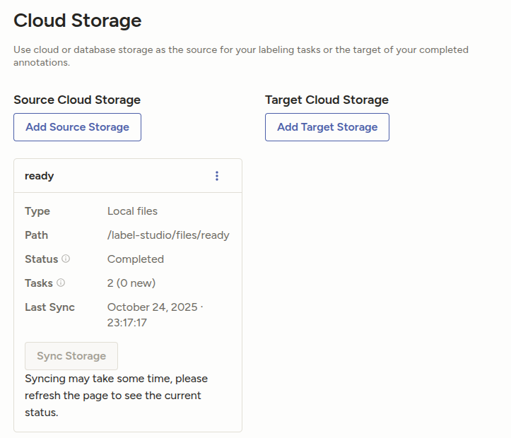

# LabelStudio
> Open Source Data Labeling Platform [https://labelstud.io/](https://labelstud.io/)

## Setting up LabelStudio and Data Paths

1. Clone repository and set labelstudio as currenty directory:
```bash
cd $HOME/repositories/mxochicale/labelstudio/main-app

```

2. Add the data you want to label to a subdirectory within the `myfiles` path, e.g. `myfiles/ready`:
```bash
mkdir -p myfiles/ready
```

3. Create my data path with root permisions

```bash
mkdir -p mydata
sudo chmod -R 777 mydata #Never Use chmod 777
#sudo rm -rf mydata
#Setting 777 permissions (chmod 777) to a file or directory means that it will be readable, writable and executable by all users and may pose a huge security risk. [https://linuxize.com/post/what-does-chmod-777-mean/]
```

4. Setup LabelStudio using Docker:

Set the --username flag to an email address for the smoothest experience. A dummy email address is sufficient: 
user@email.com
password

```bash
docker run -it --rm -p 8080:8080 -v $(pwd)/mydata:/label-studio/data --env LABEL_STUDIO_LOCAL_FILES_SERVING_ENABLED=true --env LABEL_STUDIO_LOCAL_FILES_DOCUMENT_ROOT=/label-studio/files -v $(pwd)/myfiles:/label-studio/files -v $(pwd)/myproject:/label-studio/project heartexlabs/label-studio:latest label-studio init 'READY' --username user@email.com --password password --initial-project-description 'Annotate READY images.' --label-config /label-studio/project/config.xml
```

It create the following path, illustrated as `/labelstudio/mydata`:
```
├── export
├── label_studio.sqlite3
├── media
│   └── export
└── test_data
```


5. Run LabelStudio:
```bash
docker run -it -p 8080:8080 -v $(pwd)/mydata:/label-studio/data --env LABEL_STUDIO_LOCAL_FILES_SERVING_ENABLED=true --env LABEL_STUDIO_LOCAL_FILES_DOCUMENT_ROOT=/label-studio/files -v $(pwd)/myfiles:/label-studio/files -v $(pwd)/myproject:/label-studio/project heartexlabs/label-studio:latest label-studio start READY --username user@email.com --password password
```


6. Goto LabelStudio in your browser: 
```bash
brave-browser -n --incognito http://localhost:8080/
```

7. Login to LabelStudio using the credentials initialised earlier, e.g. 
* username: 
user@email.com

* password: 
password


8. Seeting up local files as Source Storage in  LabelStudio

Goto Main Menu > Projects > READY > Settings > Cloud Storage > Source Cloud Storage [Add Source Storage] > Local Files.   
Click next and enter the following:  

Storage Title = ready
Absolute local path (inside container) = `/label-studio/files/ready`  [Test connection] > [Connection validated]
3. Import Settings & Preview
    Import Method (optional): `Files - Automatically create a tasks for each object (e.g. JPG, MP3, TXT)`
    File Name Filter (optional): `.*.(jpe?g|png|gif)$` [Select images]
    Scan all sub-folders: ON  [Load preview], [Next]
4. Review & Confirm: `Save & Sync`




## Docker commands
```bash
clear && docker images && docker ps
docker system prune -f --volumes
```

