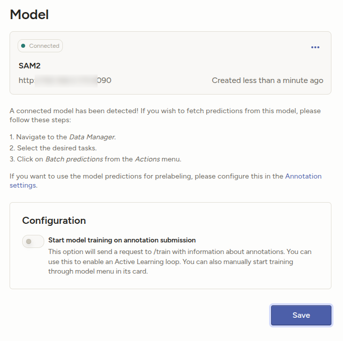
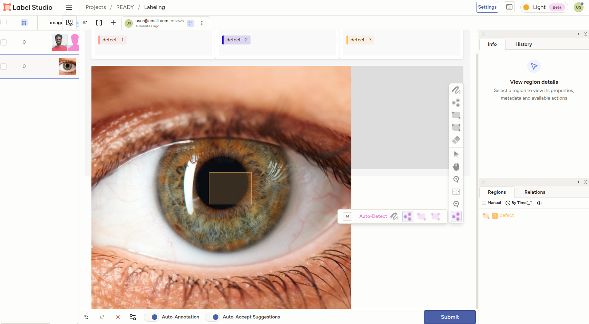

<!--
---
title: SAM2 with Images
type: guide
tier: all
order: 15
hide_menu: true
hide_frontmatter_title: true
meta_title: Using SAM2 with Label Studio for Image Annotation
categories:
    - Computer Vision
    - Image Annotation
    - Object Detection
    - Segment Anything Model
image: "/tutorials/sam2-images.png"
---
-->

# Using SAM2 with LabelStudio for Image Annotation

https://github.com/HumanSignal/label-studio-ml-backend/tree/master/label_studio_ml/examples/segment_anything_2_image

Segment Anything 2, or SAM 2, is a model released by Meta in July 2024. An update to the original Segment Anything Model, 
SAM 2 provides even better object segmentation for both images and video. In this guide, we'll show you how to use 
SAM 2 for better image labeling with label studio. 

Click on the image below to watch our ML Evangelist Micaela Kaplan explain how to link SAM 2 to your Label Studio Project.
You'll need to follow the instructions below to stand up an instance of SAM2 before you can link your model! 

[](https://www.youtube.com/watch?v=FTg8P8z4RgY)


## Before you begin

Before you begin, you must install the [Label Studio ML backend](https://github.com/HumanSignal/label-studio-ml-backend?tab=readme-ov-file#quickstart). 

This tutorial uses the [`segment_anything_2_image` example](https://github.com/HumanSignal/label-studio-ml-backend/tree/master/label_studio_ml/examples/segment_anything_2_image). 

Note that as of 8/1/2024, SAM2 only runs on GPU.


## [Optional-Already-Cloned] Clone repo 
1. Clone and build docker image for sam2 label-studio

```bash
# ORIGINALLY
git clone https://github.com/HumanSignal/label-studio-ml-backend.git
cd label-studio-ml-backend/label_studio_ml/examples/segment_anything_2_image/
mv segment_anything_2_image/ to $REPO_PATH
```


## Labeling configuration


Tag Label must be a child of one of the tags: 
- Labels, 
- EllipseLabels, 
- RectangleLabels, 
- PolygonLabels, 
- KeyPointLabels, 
- BrushLabels, 
- HyperTextLabels, 
- TimelineLabels, 
- TimeSeriesLabels, 
- ParagraphLabels.


The current implementation of the Label Studio SAM2 ML backend works using Interactive mode. The user-guided inputs are:
- `KeypointLabels`
- `RectangleLabels`

And then SAM2 outputs `BrushLabels` as a result.
This means all three control tags should be represented in your labeling configuration:

```xml
<View>
<Style>
  .main {
    font-family: Arial, sans-serif;
    background-color: #f5f5f5;
    margin: 0;
    padding: 20px;
  }
  .container {
    display: flex;
    justify-content: space-between;
    margin-bottom: 20px;
  }
  .column {
    flex: 1;
    padding: 10px;
    background-color: #fff;
    border-radius: 5px;
    box-shadow: 0 2px 5px rgba(0, 0, 0, 0.1);
    text-align: center;
  }
  .column .title {
    margin: 0;
    color: #333;
  }
  .column .label {
    margin-top: 10px;
    padding: 10px;
    background-color: #f9f9f9;
    border-radius: 3px;
  }
  .image-container {
    width: 100%;
    height: 300px;
    background-color: #ddd;
    border-radius: 5px;
  }
</Style>
<View className="main">
  <View className="container">
    <View className="column">
      <View className="title">Choose Label</View>
      <View className="label">
        <BrushLabels name="tag" toName="image">
          
          
        <Label value="defect" background="#FFA39E"/></BrushLabels>
      </View>
    </View>
    <View className="column">
      <View className="title">Use Keypoint</View>
      <View className="label">
        <KeyPointLabels name="tag2" toName="image" smart="true" showInline="true">
          
          
        <Label value="defect" background="#250dd3"/></KeyPointLabels>
      </View>
    </View>
    <View className="column">
      <View className="title">Use Rectangle</View>
      <View className="label">
        <RectangleLabels name="tag3" toName="image" smart="true">
          
          
        <Label value="defect" background="#FFC069"/></RectangleLabels>
      </View>
    </View>
  </View>
  <View className="image-container">
    <Image name="image" value="$image" zoom="true" zoomControl="true"/>
  </View>
</View>
</View>
```


## Docker compose Configuration
Parameters can be set in `docker-compose.yml` before running the container.

The following common parameters are available:
- `DEVICE` - specify the device for the model server (currently only `cuda` is supported, `cpu` is coming soon)
- `MODEL_CONFIG` - SAM2 model configuration file (`sam2_hiera_l.yaml` by default)
- `MODEL_CHECKPOINT` - SAM2 model checkpoint file (`sam2_hiera_large.pt` by default)
- `BASIC_AUTH_USER` - specify the basic auth user for the model server
- `BASIC_AUTH_PASS` - specify the basic auth password for the model server
- `LOG_LEVEL` - set the log level for the model server
- `WORKERS` - specify the number of workers for the model server
- `THREADS` - specify the number of threads for the model server


## Running with Docker

0. Start Labelstudio as in [main-app](../main-app/)

1. Open a new terminal and Start Machine Learning backend on `http://localhost:9090` with prebuilt image:

```bash
docker compose up #Attached Initial setup, debugging, seeing real-time logs
docker compose down #undeploy
docker compose stop #stop
```

2. Validate that backend is running

```bash
curl http://localhost:9090/
{"status":"UP"}
```


## Running SAM2 in LabelStudio

1. Connect to the backend from Label Studio running on the same host: go to your project `Settings -> Model -> Connect Model` and specify `http://localhost:9090` (`192.???.?.???:8080`) as a URL.

Name: SAM2
Backend URL: http://192.???.?.???:9090 # check ip with ifconfig
Select authentication method: [no authentification]
Interactive preannotations: ON
[Validate and Save]




2. Label images




## erros

* Validation error

```
Can't connect to ML backend http://localhost:9090, health check failed. Make sure it is up and your firewall is properly configured. Learn more about how to set up an ML backend. Additional info: HTTPConnectionPool(host='localhost', port=9090): Max retries exceeded with url: /health (Caused by NewConnectionError(': Failed to establish a new connection: [Errno 111] Connection refused'))
Version: 1.20.0

```


* try

```
I had the same problem with non-docler ML backend.
I had to start label studio first with
label-studio start
and only later start the ml backend with
label-studio-ml start segment_anything_2_image

I guess the http://localhost:9090 was occupied somwhow.
Also check your ml-model page by refreshing the page, so it is up.
Terveisin, Markus
#https://community.labelstud.io/t/validation-error-ml-backend-health-check-failed/209/3
```


* try

```

if you’re hosting your model on localhost, and your Label Studio is running in a different localhost, you’re going to hit an issue where “localhost” doesn’t resolve to the correct instance. Instead, try running ngrok to get a URL to your model server using the following command (I’m going to assume that your model is being hosted on port 9090, but you can change the command for whatever port you’re using).

ngrok http https://localhost:9090
Then, you can take the forwarding address that is provided by ngrok and use that. I hope this helps!

https://community.labelstud.io/t/sam2-connection-403-error/316/5


GOT

sudo snap install ngrok
ngrok (v3/stable) 3.29.0 from Ngrok (ngrok-publisher) installed
$ ngrok http https://localhost:9090
ERROR:  authentication failed: Usage of ngrok requires a verified account and authtoken.
ERROR:  
ERROR:  Sign up for an account: https://dashboard.ngrok.com/signup
ERROR:  Install your authtoken: https://dashboard.ngrok.com/get-started/your-authtoken
ERROR:  
ERROR:  ERR_NGROK_4018
ERROR:  https://ngrok.com/docs/errors/err_ngrok_4018
ERROR:  


```
* SORTED out

```

Try to connect to the local ip(1??.???.?.???:9090) of the machine you are running label studio rather than localhost:8080.

Replace the localhost:8080 with your local ip address (1??.???.?.???:9090) in the model.py of label studio ml backend. Make sure label studio is running on port 8080.
```


errors fixed with the correct ip `http://1??.???.?.???:9090`

* error
```
gethostbyname() argument 1 must be str, bytes or bytearray, not None
Traceback (most recent call last):
  File "/label-studio/.venv/lib/python3.13/site-packages/rest_framework/views.py", line 506, in dispatch
    response = handler(request, *args, **kwargs)
  File "/label-studio/.venv/lib/python3.13/site-packages/django/utils/decorators.py", line 48, in _wrapper
    return bound_method(*args, **kwargs)
  File "/label-studio/.venv/lib/python3.13/site-packages/rest_framework/generics.py", line 246, in post
    return self.create(request, *args, **kwargs)
           ~~~~~~~~~~~^^^^^^^^^^^^^^^^^^^^^^^^^^
  File "/label-studio/.venv/lib/python3.13/site-packages/rest_framework/mixins.py", line 18, in create
    serializer.is_valid(raise_exception=True)
    ~~~~~~~~~~~~~~~~~~~^^^^^^^^^^^^^^^^^^^^^^
  File "/label-studio/.venv/lib/python3.13/site-packages/rest_framework/serializers.py", line 223, in is_valid
    self._validated_data = self.run_validation(self.initial_data)
                           ~~~~~~~~~~~~~~~~~~~^^^^^^^^^^^^^^^^^^^
  File "/label-studio/.venv/lib/python3.13/site-packages/rest_framework/serializers.py", line 442, in run_validation
    value = self.to_internal_value(data)
  File "/label-studio/.venv/lib/python3.13/site-packages/rest_framework/serializers.py", line 501, in to_internal_value
    validated_value = validate_method(validated_value)
  File "/label-studio/label_studio/ml/serializers.py", line 35, in validate_url
    validate_upload_url(value, block_local_urls=settings.ML_BLOCK_LOCAL_IP)
    ~~~~~~~~~~~~~~~~~~~^^^^^^^^^^^^^^^^^^^^^^^^^^^^^^^^^^^^^^^^^^^^^^^^^^^^
  File "/label-studio/label_studio/core/utils/io.py", line 195, in validate_upload_url
    ip = socket.gethostbyname(domain)
TypeError: gethostbyname() argument 1 must be str, bytes or bytearray, not None
Version: 1.21.0
```

* error
```
Validation error
Can't connect to ML backend http://localhost:9090, health check failed. Make sure it is up and your firewall is properly configured. Learn more about how to set up an ML backend. Additional info: HTTPConnectionPool(host='localhost', port=9090): Max retries exceeded with url: /health (Caused by NewConnectionError(': Failed to establish a new connection: [Errno 111] Connection refused'))
```


## ngrok

```
Step 1: Sign up for a free ngrok account
Go to https://dashboard.ngrok.com/signup and create an account.

Step 2: Get your authtoken
After signing up, go to https://dashboard.ngrok.com/get-started/your-authtoken

Copy your authtoken (it looks like: 2ABCdefGHIjklMNOpqrSTUv1234567890XYZ)

Step 3: Install the authtoken
Option A: Using command line (recommended)

bash
ngrok config add-authtoken YOUR_AUTHTOKEN_HERE
#Authtoken saved to configuration file: /home/mxochicale/snap/ngrok/315/.config/ngrok/ngrok.yml

```

```
ngrok http --basic-auth "user:password" 80
ngrok http https://localhost:9090 --basic-auth "user:password" 80
ngrok http http://1??.???.?.???:9090 --basic-auth "user:password" 80
```


## ngrok

```bash 
ngrok http http://1??.???.?.???:9090

🫶 Using ngrok for OSS? Request a community license: https://ngrok.com/r/oss                                                                                                                                       
                                                                                                                                                                                                                  
Session Status                online                                                                                                                                                                               
Account                       mxochicale (Plan: Free)                                                                                                                                                              
Version                       3.29.0                                                                                                                                                                        
Region                        Europe (eu)                                                                                                                                                                     
Latency                       39ms                                                                                                                                                                     
Web Interface                 http://127.0.0.1:4040                                                                                                                                                                
Forwarding                    https://c266a2612467.ngrok-free.app -> https://000.000.0.000:9090                                                                                                                    
Connections                   ttl     opn     rt1     rt5     p50     p90                                                                                                                                          
                              0       0       0.00    0.00    0.00    0.00             
```


## References

* https://labelstud.io/tutorials/segment_anything_2_image
* https://labelstud.io/guide/ml#Allow-the-ML-backend-to-access-Label-Studio-data
